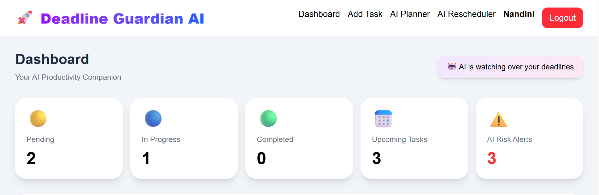

# 🚀 Deadline Guardian

An AI-powered productivity companion that helps users organize tasks, assess deadline risks, generate daily plans, break down complex tasks, and intelligently reschedule work using Google's Gemini AI.

---

## 📌 Problem Statement

Managing multiple deadlines can be overwhelming. Users often struggle to prioritize tasks, estimate workload, and create realistic daily plans.

Deadline Guardian solves this by using AI to provide personalized task guidance and smart scheduling.

---

## ✨ Features

- 🔐 Google Sign-In Authentication
- ➕ Add, Edit & Delete Tasks
- 📋 Task Dashboard
- 🤖 AI Guardian (Risk Analysis)
- 📅 AI Daily Planner
- 🧩 AI Task Breakdown
- 🔄 AI Rescheduler
- ☁️ Firebase Authentication & Firestore
- 🌐 Deployed on Google Cloud Run

---

## 🛠️ Tech Stack

### Frontend
- React
- Vite
- Tailwind CSS

### Backend & Database
- Firebase Authentication
- Cloud Firestore

### AI
- Google Gemini API
- Google GenAI SDK

### Deployment
- Google Cloud Run
- Docker
- Nginx

---

## ☁️ Google Technologies Used

- Google AI Studio
- Gemini 2.5 Flash
- Google Cloud Run
- Firebase Authentication
- Cloud Firestore
- Cloud Build
- Artifact Registry

---

## 📸 Screenshots

### Dashboard


### Add Task


### My Tasks


### AI Guardian


### AI Daily Planner


### AI Rescheduler


### Task Rescheduler


---

## 🎥 Demo Video

Demo Video:

📁 `screenshots/Demo.mp4`

*https://drive.google.com/file/d/16Ap-lEsR4EVjDfX7FVFhQsb3TABQRwfh/view?usp=sharing*

---

## 🚀 Run Locally

```bash
git clone https://github.com/nandiniganeshs-123/deadline-guardian.git

cd deadline-guardian

npm install

npm run dev
```

Create a `.env` file:

```env
VITE_GEMINI_API_KEY=YOUR_API_KEY
```

---

## ☁️ Deployment

The application is containerized using Docker and deployed on **Google Cloud Run**.
 https://deadline-guardian-1077625683515.asia-south1.run.app

---

## 👩‍💻 Author

**Nandini G**

GitHub:
https://github.com/nandiniganeshs-123

---

